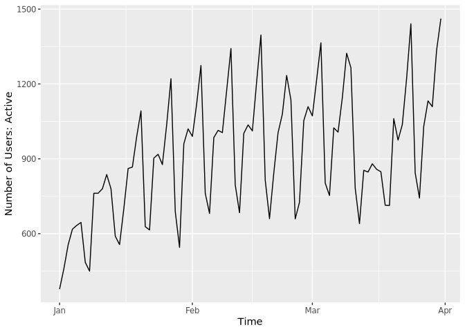
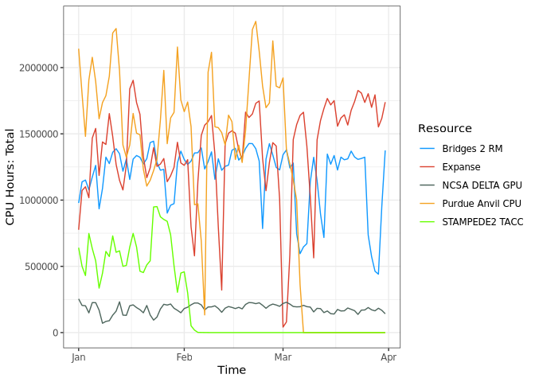

<!-- README.md is generated from README.Rmd. Please edit that file -->

# RXDMoD - R API for XDMoD Data Analytics Framework

Version: 1.0.0

As part of the XDMoD Data Analytics Framework, this R package provides
API access to the data warehouse of an instance of XDMoD.

<!-- badges: start -->
<!-- badges: end -->

## Installation

### Install Python API

First, you need to install python with pandas. Bellow is pandas-jupyter
complete environment for data-analysis. It is probably overkill for just
forwarding requests through XDMoD Python API, but it can be a good
choice for cross-language developments/work.

``` bash
# create a new conda environment called "xdmod-notebooks"
conda create -n xdmod-notebooks -y python=3.11
conda activate xdmod-notebooks
# base-notebook
conda install -y 'jupyterlab' 'notebook' 'jupyterhub' 'nbclassic'
# scipy-notebook
conda install -y  'altair' 'beautifulsoup4' 'bokeh' 'bottleneck' 'cloudpickle' \
    'conda-forge::blas=*=openblas' \
    'cython' 'dask' 'dill' 'h5py' 'ipympl' 'ipywidgets' 'jupyterlab-git' \
    'matplotlib-base' 'numba' 'numexpr' 'openpyxl' 'pandas' 'patsy' 'protobuf' \
    'pytables' 'scikit-image' 'scikit-learn' 'scipy' 'seaborn' 'sqlalchemy' \
    'statsmodels' 'sympy' 'widgetsnbextension' 'xlrd'
# Other
conda install -y 'pymysql' 'requests'
```

Install XDMoD Python API:

``` bash
pip install --upgrade 'xdmod-data>=1.0.0,<2.0.0' python-dotenv tabulate
```

### Install RXDMoD

If you don’t have R yet you can install it with conda too:

``` bash
# r-notebook  r=4.3
conda install -y 'r-base' 'r-caret' 'r-crayon' 'r-devtools' 'r-e1071' \
    'r-forecast' 'r-hexbin' 'r-htmltools' 'r-htmlwidgets' 'r-irkernel' \
    'r-nycflights13' 'r-randomforest' 'r-rcurl' 'r-rmarkdown' 'r-rodbc' \
    'r-rsqlite' 'r-shiny' 'r-tidymodels' 'r-tidyverse' 'unixodbc'

# Other
conda install -y \
    'r-plotly' 'r-repr' 'r-irdisplay' 'r-pbdzmq' 'r-reticulate' 'r-cowplot' \
    'r-rjson' 'r-dotenv'
```

Install rstudio server:

``` bash
wget "https://download2.rstudio.org/server/jammy/amd64/rstudio-server-2023.12.1-402-amd64.deb"
sudo dpkg -i rstudio-server-*-amd64.deb
rm rstudio-server-*-amd64.deb

# specify which version of r to use
echo "rsession-which-r=$(which R)" | sudo tee -a /etc/rstudio/rserver.conf
```

Alternatively you can install regular rstudio:

``` bash
wget "https://download1.rstudio.org/electron/jammy/amd64/rstudio-2023.12.1-402-amd64.deb"
sudo dpkg -i rstudio-2023.12.1-402-amd64.deb
rm rstudio-*-amd64.deb
```

You can install the development version of rxdmod from
[GitHub](https://github.com/) with:

``` r
# install.packages("devtools")
devtools::install_github("ubccr/rxdmod")
```

### Set up XDMoD API Token

#### Obtain an API token

You will need to get XDMoD-API token in order to access XDMoD Analytical
Framework.

Follow [these
instructions](https://github.com/ubccr/xdmod-data#api-token-access) to
obtain an API token.

#### Store the API token in .Renveron (The R-Way)

Write the token to `~/.Renviron` file:

``` bash
cat >> ~/.Renviron << EOF
XDMOD_API_TOKEN=<my secret xdmod api token>
EOF
```

It will be loaded automatically (you might need to restart R-session at
first use).

#### Alternatively Store the API token at Same Place as XDMoD Python API

If you use XDMoD Python API as well then storing token in same file as
in Python API can be handy.

Write the token to `~/xdmod-data.env` file:

``` bash
cat >> ~/xdmod-data.env << EOF
XDMOD_API_TOKEN=<my secret xdmod api token>
EOF
```

Load it in your R-session, before calling `xdmod_get_datawarehouse`:

``` r
library(dotenv)
# on windows ~ points to Documents, adjust accordingly
load_dot_env(path.expand("~/xdmod-data.env"))
```

## RXDMoD Usage Example

``` r
library(tidyverse)
library(plotly)

# replace xdmod-notebooks with conda enviroment for python to use
library(reticulate)
use_condaenv("xdmod-notebooks")

library(rxdmod)
```

``` r
# Get XDMoD connection
dw <- xdmod_get_datawarehouse('https://xdmod.access-ci.org')

# Get Data of Interest
df <- xdmod_get_data(dw,
        duration=c('2023-01-01', '2023-03-31'),
        realm='Jobs',
        metric='Number of Users: Active'
    )
```

Plot the data

``` r
ggplot(df, aes(x=Time,y=`Number of Users: Active`)) +
        geom_line()
```



Get CPU hours by Resources:

``` r
# Get Data of Interest
df <- xdmod_get_data(dw,
        duration=c('2024-01-01', '2024-03-31'),
        realm='Jobs',
        dimension='Resource',
        metric='CPU Hours: Total'
    ) |>
  group_by(Resource) |>
  summarize(`CPU Hours: Total`=sum(`CPU Hours: Total`)) %>%
  arrange(-`CPU Hours: Total`)
df
#> # A tibble: 19 × 2
#>    Resource           `CPU Hours: Total`
#>    <chr>                           <dbl>
#>  1 Expanse                    125104639.
#>  2 Bridges 2 RM               109010078.
#>  3 Purdue Anvil CPU           105480095.
#>  4 STAMPEDE2 TACC              19728084.
#>  5 NCSA DELTA GPU              16517194.
#>  6 NCSA DELTA CPU               8134046.
#>  7 Texas A&M U FASTER           4646842.
#>  8 IACS Ookami                  1767962.
#>  9 Bridges 2 GPU                1498234.
#> 10 Expanse GPU                  1447462.
#> 11 UD DARWIN                    1043574.
#> 12 Purdue Anvil GPU              718512.
#> 13 Bridges 2 EM                  436539.
#> 14 TACC STAMPEDE3                281434.
#> 15 JHU Rockfish RM               115646.
#> 16 UD DARWIN GPU                   1095.
#> 17 KyRIC                           1002.
#> 18 PSC Neocortex                    805.
#> 19 Bridges2 GPU AI                  194.
```

``` r
# Get Data of Interest
df <- xdmod_get_data(dw,
        duration=c('2024-01-01', '2024-03-31'),
        realm='Jobs',
        dimension='Resource',
        metric='CPU Hours: Total',
        filter=list(
          Resource=c("Expanse","Bridges 2 RM","Purdue Anvil CPU",
                     "STAMPEDE2 TACC","NCSA DELTA GPU")
        )
    )
```

Plot the data

``` r
ggplot(df,aes(x=Time, y=`CPU Hours: Total`, color=Resource)) + 
  geom_line() + theme_xdmod()
```



``` r
# to set theme_xdmod as default:
# theme_set(theme_xdmod())
```

Some other commands:

``` r
# show available realms
xdmod_describe_realms(dw)
# show available metrics
xdmod_describe_metrics(dw, 'Jobs')
# show available dementions
xdmod_describe_dimensions(dw,'Jobs')
# show available filters
xdmod_get_filter_values(dw, 'Jobs', 'Resource')
# show aggregation units
xdmod_get_aggregation_units(dw)
# get raw, job-level, data
df <- xdmod_get_raw_data(dw,
    duration=c("2024-01-01", "2024-01-31"),
    realm='SUPREMM',
    filters=list(Application=c("gromacs","amber","charmm","lammps","namd")),
    convert_timestamp=TRUE,
    strings_as_factors=FALSE
)
# set XDMoD theme for ggplot
theme_set(theme_xdmod())
```
